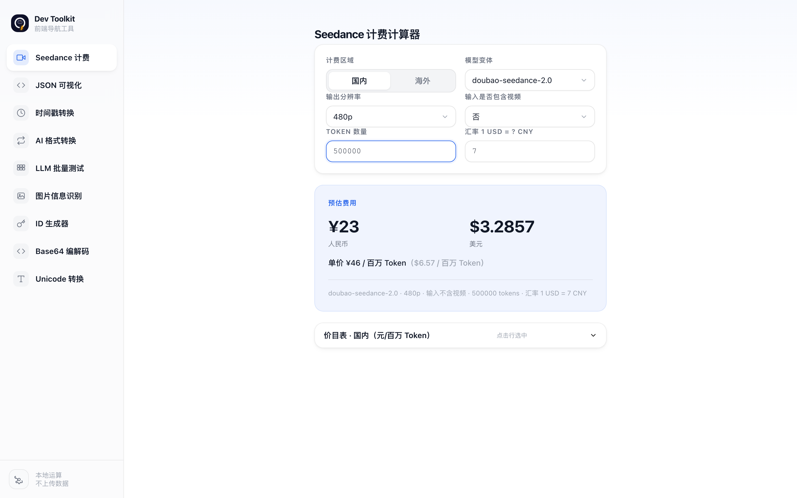
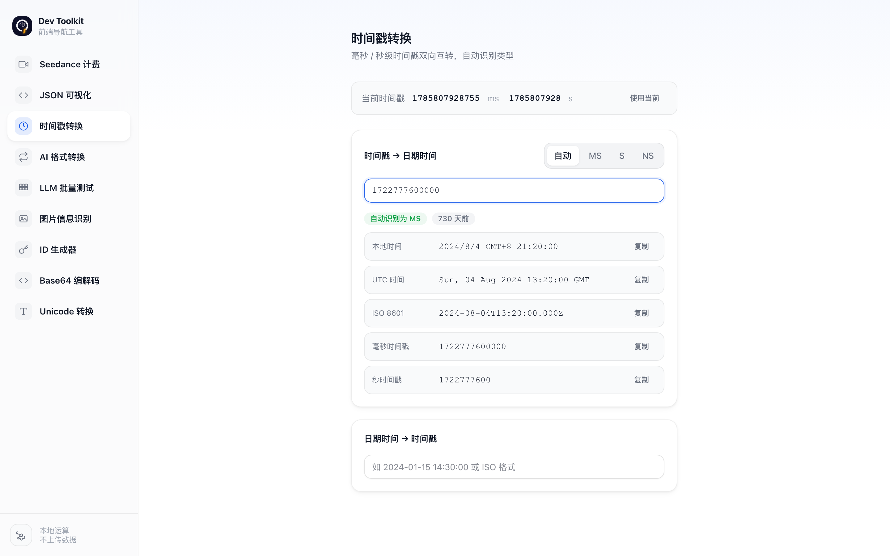
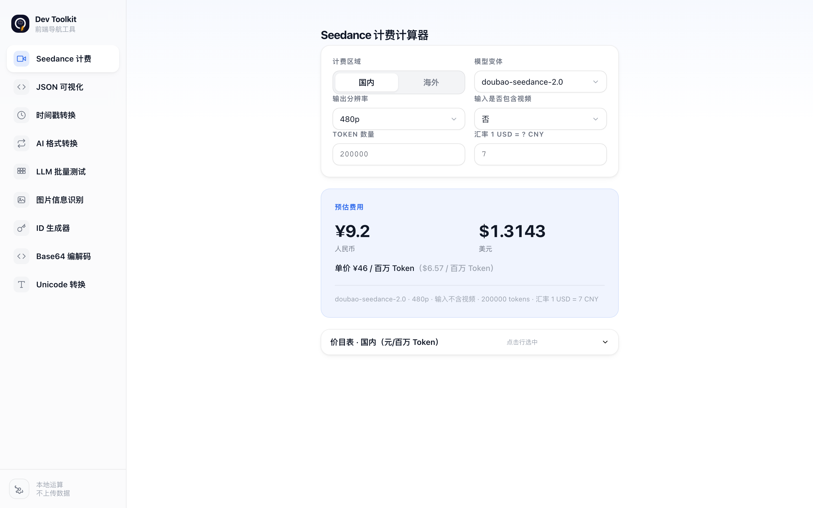
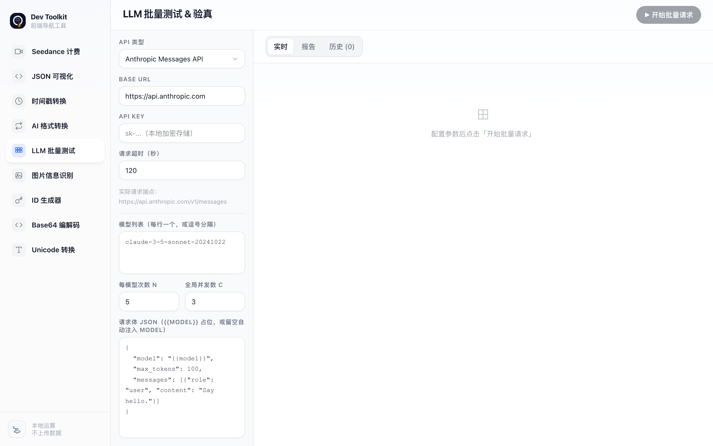
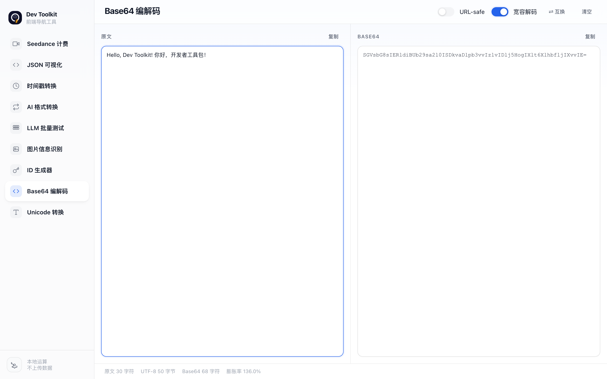
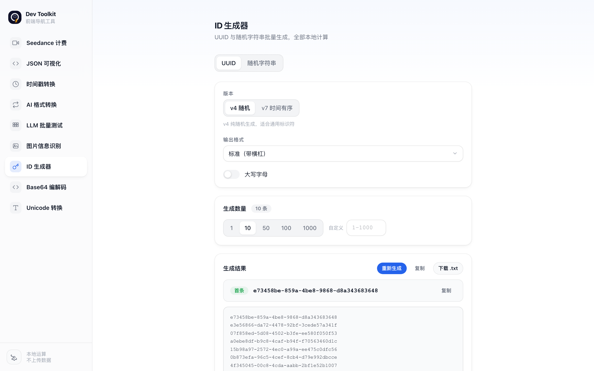
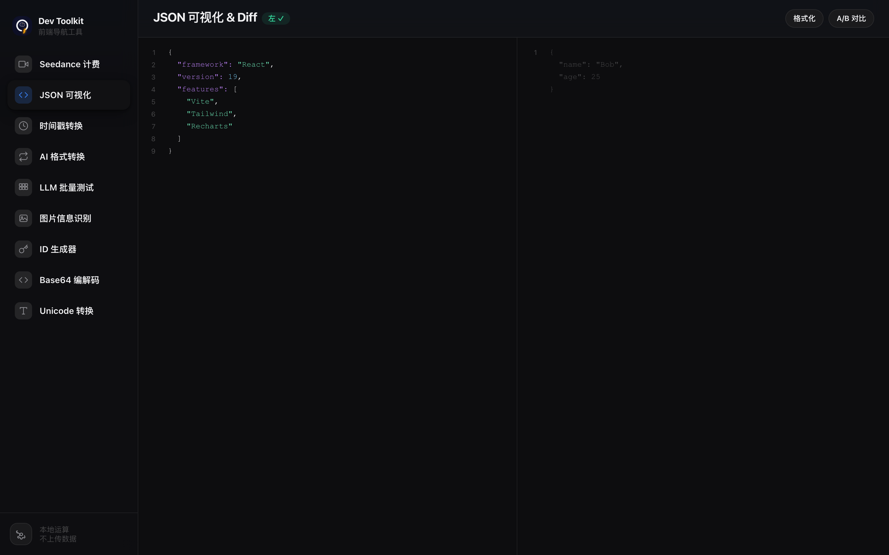

# Dev Toolkit

> 纯前端实现，零服务端依赖

[](https://opensource.org/licenses/MIT)

---

## 介绍

**Dev Toolkit** 是一个纯前端实现、零服务端依赖的开发工具箱，所有数据均在浏览器本地处理，**不会上传到任何服务器**。包含 13 个实用工具，覆盖计费计算、JSON 处理、时间戳转换、AI 格式转换、LLM 测试、模型探测、图片与视频分析、ID 生成、编解码等领域，服务前后端开发者。

---

## 截图

### 主界面



### JSON 可视化 & Diff


### 时间戳转换



### 图片信息识别



### LLM 批量测试



### Base64 编解码



### ID 生成器



### 深色主题



---

## 特性

- ✅ **纯前端** — 所有计算在浏览器本地完成，不上传数据
- ✅ **13 个实用工具** — 覆盖日常开发高频需求
- ✅ **4 套主题** — 浅色、深色、暖陶、山野绿，一键切换
- ✅ **毛玻璃 UI** — 现代化毛玻璃设计，兼顾美观与可读性
- ✅ **数据持久化** — 配置和偏好自动保存到 localStorage
- ✅ **响应式布局** — 适配不同屏幕尺寸
- ✅ **无障碍设计** — 尊重 `prefers-reduced-motion` 和 `prefers-contrast` 系统偏好

---

## 工具一览

| 工具 | 直达路径 | 说明 |
|------|----------|------|
| **Seedance 计费** | `/tools/seedance` | 火山方舟 / BytePlus ModelArk 视频生成模型计费计算器，自动计算人民币和美元 |
| **图片视频计费**（Beta） | `/tools/multicost` | 多模型图片/视频生成计费：Seedance、Grok Image/Video、GPT Image、Gemini Image，双币种与粘贴 JSON 自动识别 |
| **JSON 可视化** | `/tools/json` | 双栏 JSON 查看/编辑、折叠、行号与 A/B Diff 对比 |
| **时间戳转换** | `/tools/timestamp` | 毫秒/秒/纳秒级时间戳与日期时间双向转换 |
| **AI 格式转换** | `/tools/aiconvert` | OpenAI Chat、Anthropic Messages、OpenAI Responses 请求体互转 |
| **LLM 批量测试** | `/tools/llmbatch` | Token 计费口径、一致性、波动和返回模型验真 |
| **图片接口测试** | `/tools/imgtest` | 多渠道图片生成接口批测、价格与响应校验 |
| **模型探测** | `/tools/modelprobe` | API 渠道兼容性、参数降级、缓存和 Token 稳定性实验台 |
| **图片信息识别** | `/tools/imganalyze` | 图片分辨率、格式、尺寸和分辨率等级识别 |
| **视频信息检测** | `/tools/videoanalyze` | 本地文件或 URL 视频元信息与播放检测 |
| **ID 生成器** | `/tools/idgen` | UUID v4/v7 和密码学安全随机字符串批量生成 |
| **Base64 编解码** | `/tools/base64` | 双向编解码、URL-safe 模式和宽容解码 |
| **Unicode 转换** | `/tools/unicode` | 六种 Unicode 表示格式的编码与自动解码 |
| **GraphQL 格式化** | `/tools/graphql` | GraphQL 查询格式化、压缩与语法检查 |

---

## 快速开始

```bash
# 克隆项目
git clone https://github.com/your-username/dev-toolkit.git
cd dev-toolkit

# 安装依赖
npm install

# 启动开发服务器
npm run dev

# 访问 http://localhost:8443（首页为工具导航，也可直达具体工具）

# 生产构建
npm run build

# 预览生产构建
npm run preview
```

也可以直接访问具体工具，例如 `http://localhost:8443/tools/imgtest`；首页 `/` 以卡片网格展示全部 13 个工具。

### 生产部署的路由回退

本项目使用 History API 路由。生产服务器必须把 `/tools/*` 以及其他前端路径回退到根目录的 `index.html`，再由应用判断工具是否存在；否则刷新或直接打开深层链接时，静态服务器可能返回 404。具体 rewrite 写法由实际使用的 Nginx、Vercel、Cloudflare 等托管环境配置。

---

## 技术栈

| 技术 | 用途 |
|------|------|
| [React 19](https://react.dev/) | UI 框架 |
| [Vite 8](https://vitejs.dev/) | 构建工具 |
| [Tailwind CSS v4](https://tailwindcss.com/) | 样式框架 |
| [Recharts v3](https://recharts.org/) | 图表库（LLM 测试输出 Token 波动图） |
| [TypeScript](https://www.typescriptlang.org/) | 类型安全 |
| [Playwright](https://playwright.dev/) | 端到端测试 |

---

## 主题

| 主题 | 说明 |
|------|------|
| ◐ 浅色 | 白色背景，蓝色强调色 |
| ● 深色 | 近黑色背景，蓝色强调色 |
| ✦ 暖陶 | 暖白/陶土色，哑光土红强调色 |
| ◉ 山野绿 | 灰绿色，哑光鼠尾草绿强调色 |

主题偏好自动保存到 `localStorage`，默认跟随系统 `prefers-color-scheme`。

---

## 项目结构

```
/
├── index.html           # HTML 入口
├── package.json         # 依赖与脚本
├── vite.config.ts       # Vite 配置
├── tsconfig.json        # TypeScript 配置
├── public/
│   ├── logo.svg         # Logo
│   └── screenshots/     # 截图
├── src/
│   ├── main.tsx         # React 入口
│   ├── App.tsx          # 应用外壳（主题、侧边栏与 URL 路由）
│   ├── HomePage.tsx     # 首页（/ 路由，工具卡片导航）
│   ├── toolRegistry.tsx # 13 个工具的注册、路径与懒加载配置
│   ├── tools/           # 各工具独立模块
│   └── index.css        # 全局样式 + Tailwind CSS
└── e2e/                 # Playwright 端到端测试
    ├── helpers.ts
    ├── app.spec.ts
    ├── json.spec.ts
    ├── llmbatch.spec.ts
    ├── timestamp.spec.ts
    ├── aiconvert.spec.ts
    ├── base64.spec.ts
    ├── unicode.spec.ts
    ├── idgen.spec.ts
    └── seedance.spec.ts
```

## 开源协议

[MIT](https://opensource.org/licenses/MIT)
