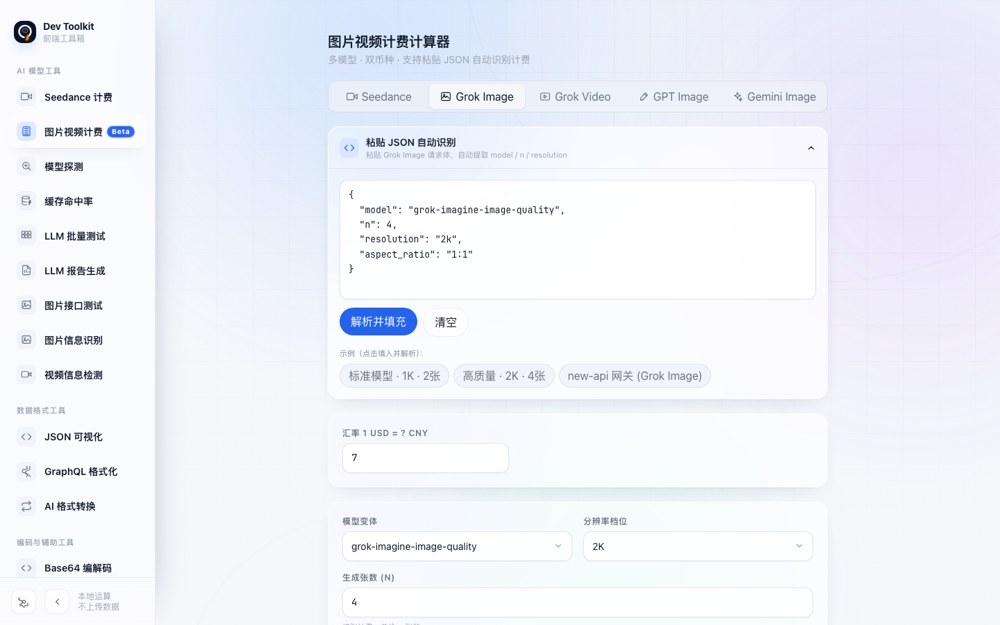
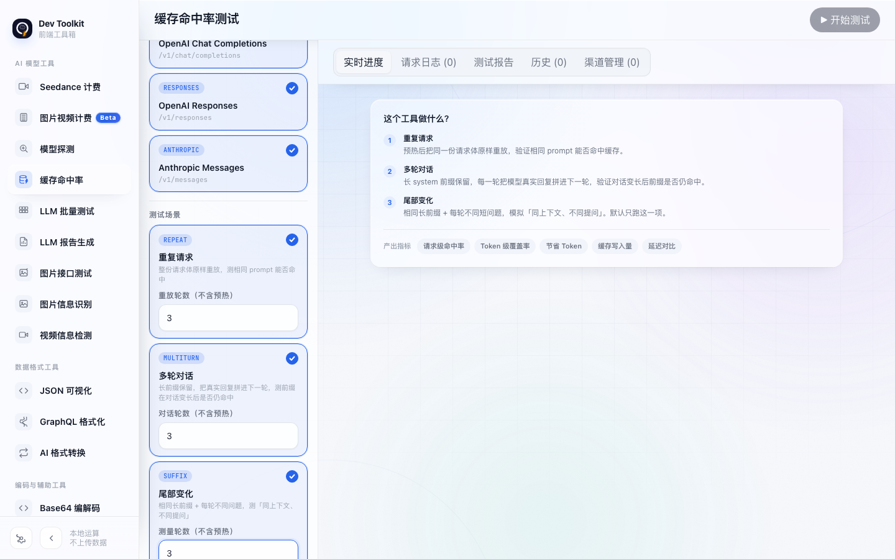
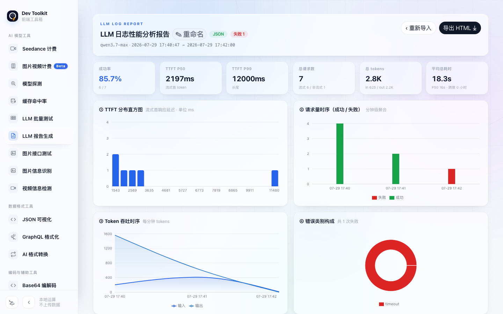
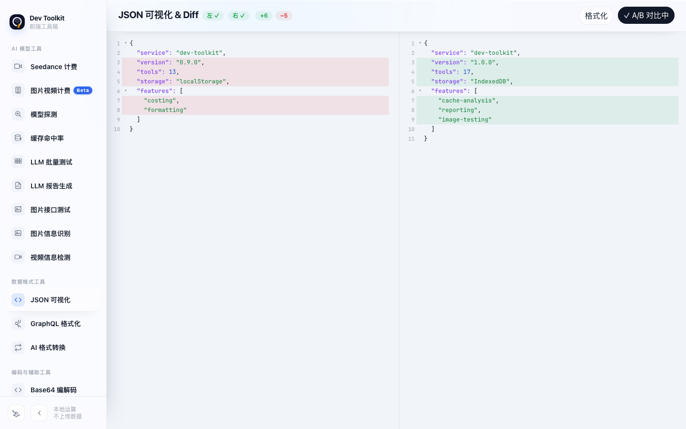

# Dev Toolkit

> 面向开发场景的纯前端工具箱

[](https://opensource.org/licenses/MIT)

## 简介

Dev Toolkit 是一个零自有服务端依赖的开发工具箱，提供 17 项工具，覆盖 AI 模型测试与分析、数据格式处理及编码辅助等常用场景。

工具配置和历史记录保存在浏览器本地 IndexedDB。除用户主动调用所配置的 API 或输入的 URL 外，应用不会经由自有服务器传输数据。

## 截图

### 首页工具总览


### 图片视频计费



### 缓存命中率测试



### LLM 报告生成



### 图片接口测试


### JSON 可视化与 Diff



## 特性

- **纯前端运行**：无需自建服务端，计算和本地数据管理均在浏览器中完成。
- **17 项工具**：覆盖模型计费、接口测试、报告分析、格式转换和编码辅助。
- **本地持久化**：配置与历史记录使用 IndexedDB 保存；敏感密钥以浏览器端 AES-GCM 加密存储。
- **多主题与响应式界面**：提供浅色、深色、暖陶、山野绿四套主题，并适配不同屏幕尺寸。

## 工具一览

| 工具 | 路径 | 说明 |
| --- | --- | --- |
| Seedance 计费 | `/tools/seedance` | 计算 Seedance 视频生成模型的人民币和美元费用。 |
| 图片视频计费（Beta） | `/tools/multicost` | 计算多模型图片与视频生成费用，并支持 JSON 自动识别。 |
| 模型探测 | `/tools/modelprobe` | 检测 API 渠道兼容性、参数降级和缓存能力。 |
| 缓存命中率 | `/tools/cachehit` | 测试三种协议的 Prompt Caching 命中率、覆盖率与延迟。 |
| LLM 批量测试 | `/tools/llmbatch` | 核查 Token 计费口径、一致性、输出波动与模型标识。 |
| LLM 报告生成 | `/tools/llmreport` | 将日志转化为性能与稳定性分析报告，并支持 HTML 导出。 |
| 图片接口测试 | `/tools/imgtest` | 批量测试图片生成接口，并校验响应与参考价格。 |
| 图片信息识别 | `/tools/imganalyze` | 识别图片分辨率、格式、尺寸及分辨率等级。 |
| 视频信息检测 | `/tools/videoanalyze` | 检测本地文件或 URL 视频的元信息与播放能力。 |
| JSON 可视化 | `/tools/json` | 提供 JSON 查看、编辑、折叠和 A/B Diff 对比。 |
| GraphQL 格式化 | `/tools/graphql` | 格式化、压缩并检查 GraphQL 查询语法。 |
| AI 格式转换 | `/tools/aiconvert` | 转换 OpenAI Chat、Anthropic Messages 和 OpenAI Responses 请求体。 |
| Base64 编解码 | `/tools/base64` | 支持标准、URL-safe 与宽容模式的 Base64 编解码。 |
| Unicode 转换 | `/tools/unicode` | 在六种 Unicode 表示格式之间编码与自动解码。 |
| 时间戳转换 | `/tools/timestamp` | 双向转换毫秒、秒、纳秒时间戳与日期时间。 |
| 提示词优化 | `/tools/promptopt` | 辅助选择结构化框架、编写系统提示词并进行智能优化。 |
| ID 生成器 | `/tools/idgen` | 批量生成 UUID v4、UUID v7 和安全随机字符串。 |

## 快速开始

```bash
git clone https://github.com/monkeyz6/dev-tools.git
cd dev-tools
npm install
npm run dev
```

默认访问地址为 `http://localhost:8443`。生产构建与本地预览分别使用 `npm run build` 和 `npm run preview`。

如需重新生成 README 截图，请运行：

```bash
npm run screenshots
```

## 技术栈

| 技术 | 用途 |
| --- | --- |
| [React 19](https://react.dev/) | 用户界面 |
| [Vite 8](https://vitejs.dev/) | 构建与开发服务 |
| [Tailwind CSS v4](https://tailwindcss.com/) | 样式系统 |
| [Recharts](https://recharts.org/) / [ECharts](https://echarts.apache.org/) | 数据可视化与报告图表 |
| [Playwright](https://playwright.dev/) | 端到端测试与截图生成 |

## 开源协议

[MIT](https://opensource.org/licenses/MIT)
